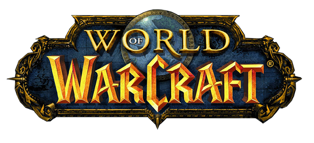

<div align="center">
  
  <h1>WoW‑RCG – World of Warcraft Random Character Generator</h1>
  <em>Generate fully random (or filtered) WoW characters: faction, race, class, server & name – with WoW‑styled interface.</em>
  <p><strong>Status:</strong> Active • <strong>License:</strong> MIT • <strong>Last Updated:</strong> Nov 24, 2025</p>
  <p><sub>Fan-made project – not affiliated with Blizzard Entertainment.</sub></p>
</div>

## Table of Contents
1. Overview
2. Features
3. Demo & Screenshots
4. Quick Start (Windows & Manual)
5. Usage Guide
6. Project Structure
7. Data & Extensibility
8. Performance & Quality
9. Roadmap / Improvements
10. License
11. Credits


## 1. Overview
WoW‑RCG is a front‑end single‑page generator written in vanilla HTML/CSS/JavaScript. It produces random character combinations using curated data sources (classes, races, factions, syllable‑based name construction, and connected realm lists). Designed for inspiration, theming, roleplay, or quick character creation.

## 2. Features
- Random character generation: faction, race, class, optional server & name.
- Filter controls: Horde / Alliance / Any + class / race constraints.
- Name synthesis: gendered syllable pools per race (extensible).
- Server selection: EU connected-realm sampling (more regions pluggable).
- Cinematic looping video / image backgrounds (easily swappable).
- Lock & reroll mechanics (retain selected traits, randomize the rest).
- Keyboard shortcuts (e.g. Space/G to generate, R for Random All).
- Generation counter with local persistence (`localStorage`).
- Copy-to-clipboard helper for sharing results.

## 3. Demo & Screenshots

If you would like, request screenshot placeholders and they can be added.

## 4. Quick Start

### A) Recommended (Windows – launch script)
1. Install Node.js (includes `npx`). Verify: `node --version`, `npx --version`.
2. Double‑click `launch.bat` (starts a lightweight static server on `http://127.0.0.1:8000`).
3. Browser opens automatically; if not, visit `http://127.0.0.1:8000` manually.

Troubleshooting tips are in `How to launch (Windows).txt`.

### B) Manual
```
npx http-server -p 8000 -a 127.0.0.1
# then browse to:
http://127.0.0.1:8000
```

### C) Minimal (No Server)
Open `generator.html` directly. Works only if the browser allows ES modules from file URLs (Chrome often blocks advanced module usage). A local server is recommended.

## 5. Usage Guide
1. Open the generator page (e.g. `index.html` / `generator.html`).
2. Optionally set faction / race / class filters.
3. Toggle name generation & server inclusion if desired.
4. Press Generate (or hit Space / G). Use Random All (or R) to ignore filters & fully randomize.
5. Use lock controls to keep specific attributes while rerolling others.
6. Copy name results using the copy button for quick pasting into WoW.

## 6. Project Structure (Key Files)
```
index.html          # Entry / main generator UI
portal.html         # (If present) Intro / portal screen
script.js           # Core logic / generation orchestration
gameData.js         # Faction / race / class data
nameData.js         # Syllable definitions per race & gender
servers.js          # EU connected realm list (extensible)
style.css           # Global + shared styles
assets/css/*.css    # Page‑specific styles (generator / portal)
launch.bat          # Convenience server launcher (Windows)
LICENSE             # MIT license text
```
Additional assets under `assets/` & `icons/` provide UI textures, fonts, audio, and imagery.

## 7. Data & Extensibility
| Domain | Source File | How to Extend |
|--------|-------------|---------------|
| Classes / Races / Factions | `gameData.js` | Add new variants or sub‑groups; keep naming consistent |
| Name syllables | `nameData.js` | Append new syllable arrays per race/gender; ensure balanced lengths |
| Realms | `servers.js` | Add objects for NA / OCE / other regions; maintain structure |

Notes:
- Keep data arrays normalized; generation logic expects consistent keys.
- Add validation if introducing new optional attributes (e.g. specialization, level).

## 8. Performance & Quality
- Deferred non‑critical scripts.
- Lightweight vanilla JS (no external runtime dependencies).
- Local caching via `localStorage` for generation counts.
- Modular data separation for easier lazy‑loading (future enhancement).

## 9. Roadmap / Improvements
Planned / suggested next steps:
- Character history & favorites.
- Export as shareable image / card.
- URL parameter sharing (seed & locked attributes).
- Multi‑character party generation.
- Class specializations & talent flavor.
- Lore snippets per race/class combo.
- Theme toggle (Dark / Light / Classic parchment).
- Sound / subtle UI feedback pack.
- Rewrite the server launch

## 10. License
This project is released under the MIT License – see `LICENSE` for full text.

## 11. Credits
- Author: Bozhidar Inzov (GitHub: [InzataFreeTV](https://github.com/InzataFreeTV))
- World of Warcraft IP & lore © Blizzard Entertainment (used under fan project context; no affiliation).
- Community feedback & open data sources for realm connectivity.

---
Enjoy generating Characters! ⚔️